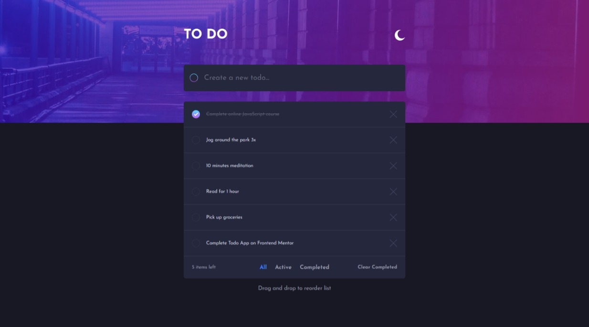

# Frontend Mentor - Todo app

## Welcome! 👋

Thanks for checking this front-end coding challenge.

**To do this challenge, you need a good understanding of HTML, CSS and JavaScript.**

## The challenge

To do list with Javascript

Feature of my to do list :

- View the optimal layout for the app depending on their device's screen size
- See hover states for all interactive elements on the page
- Add new todos to the list
- Mark todos as complete
- Delete todos from the list
- Filter by all/active/complete todos
- Clear all completed todos
- Toggle light and dark mode
- Drag and drop to reorder items on the list
